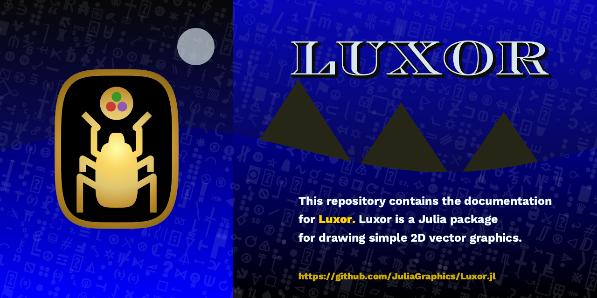

# Luxor Manual

[![][docs-stable-img]][docs-stable-url] | [![][docs-development-img]][docs-development-url] 

## Luxor Manual

This repo contains the documentation for [Luxor](https://github.com/JuliaGraphics/Luxor.jl).

Luxor is a Julia package for drawing simple static 2D vector graphics. 
It provides basic drawing functions and utilities for working with shapes, polygons, clipping masks, 
PNG and SVG images, turtle graphics, and simple animations.

[docs-development-img]: https://img.shields.io/badge/docs-development-blue
[docs-development-url]: https://juliagraphics.github.io/LuxorManual/dev/

[docs-stable-img]: https://img.shields.io/badge/docs-stable-blue.svg
[docs-stable-url]: https://juliagraphics.github.io/LuxorManual/stable/
